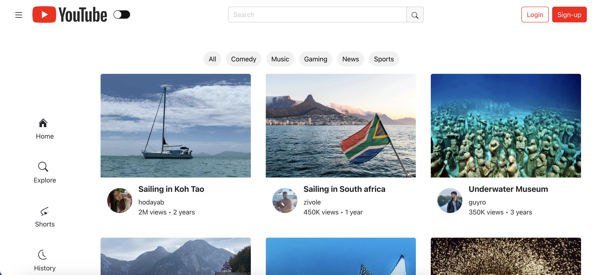
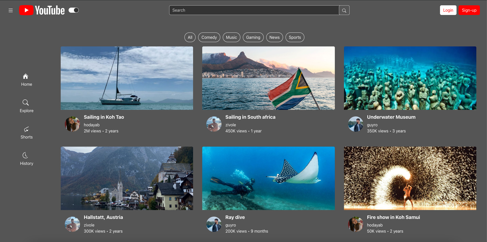
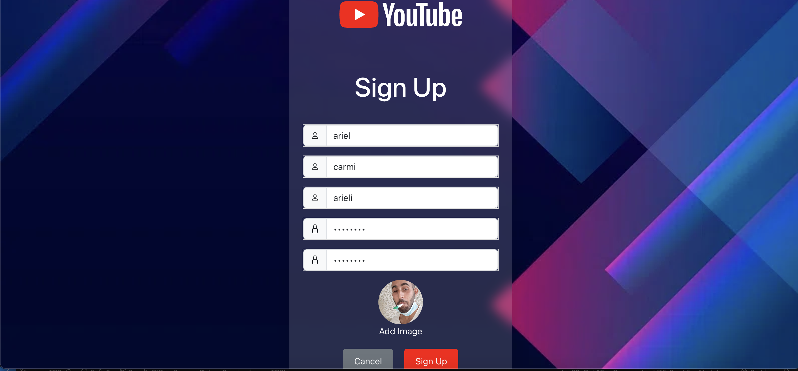
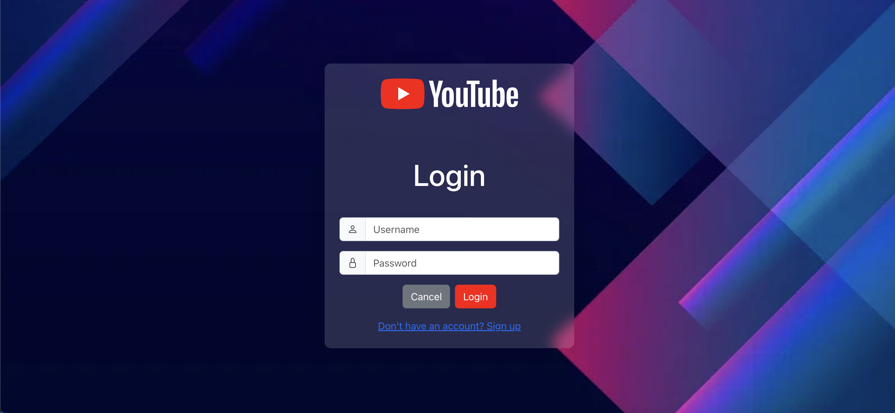
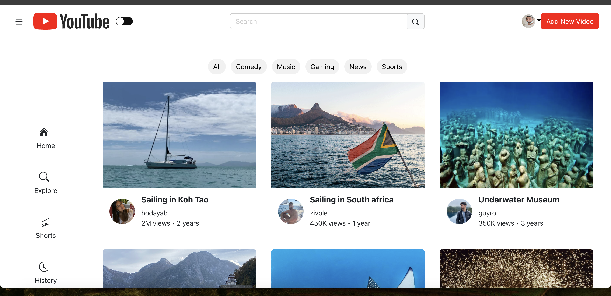
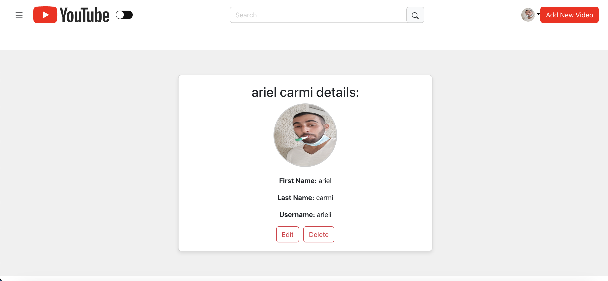
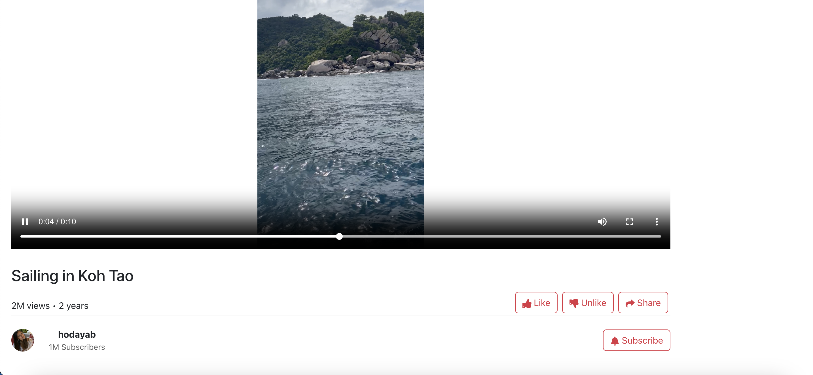
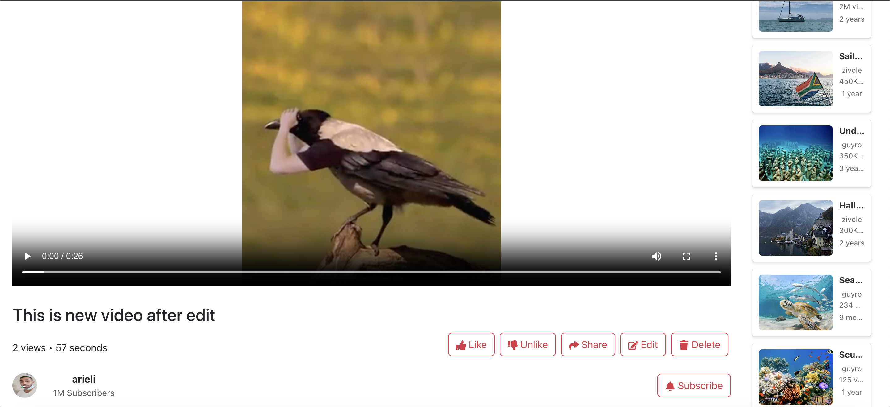
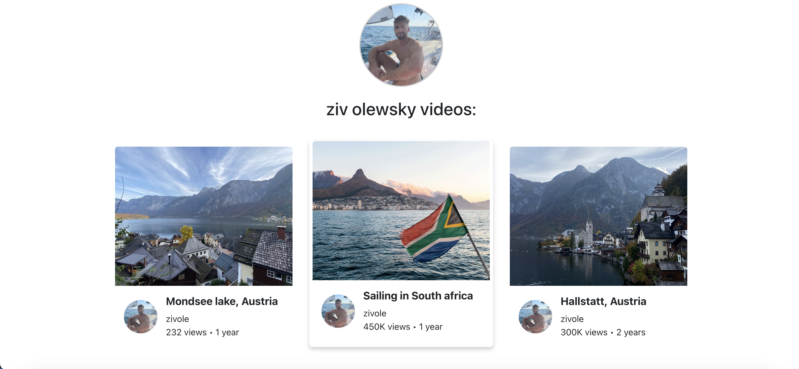
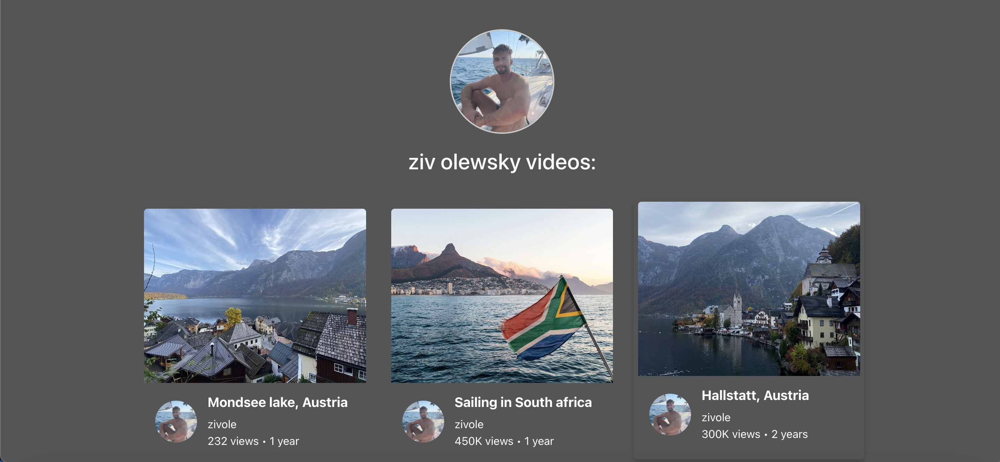

## Welcome to our Youtube platform for Web:

### Home Page
Our video page allows you to:
- Displays a list of videos including popular and randomly selected videos:

and in dark mode:

### Signup Page
Our registration page can be accessed by clicking on the login button on the homepage side bar. Here, you can create a new user account by filling out the following fields:
- First name, last name, username, password, and profile picture.
- Password requirements: more than 8 characters, including at least one uppercase and one lowercase letter, numbers, at least one special character, and no spaces.
- Confirm your password to ensure values match.
- To add a picture, click on the circular button marked with a '+' and ensure you are uploading a compatible image file.
- Once all details are correctly filled in, you will receive a notification that your registration has been successfully completed, and you will be redirected back to the home page.
- Users on the signup page can navigate directly to the login page by clicking on the link at the bottom of the page.

signup view:

### Login Page
Our login page, to reach our login page, you can click on the login button that appears on the navigation bar on the homepage. Only users who have already registered on our YouTube site will be able to log in. If the user is not registered or enters incorrect details, an appropriate message will be displayed on the screen. If the user successfully logs in with the correct details, a login message will appear on the screen and the user will be redirected back to the homepage. Additionally, a user who is not registered and is on the login page can directly navigate to the registration page by clicking on the link at the bottom of the login page.
for this part of the project we have 3 users already saved in the server for siging in, The registered users details will be at the MongoDB when you run the server. 

Login view:

Once logged in, your profile image will display in the navigation drawer bar:

### Profile page
- By clicking on the profile picture of a logged in user on the home page in the sidebar you can go to that user's profile page.
- On this page you can edit the details of that user or delete the user from the site.

View Profile page:

### Upload Videos Page
After you've logged in, click on the "+" floating button to navigate to the Upload Video Page. Here, you can:
- Click on an Image View (that displays an upload icon) to pick a video from your gallery.
- Give the video a title and then upload it.
- After uploading, see your video added on the Home Page along with your user’s details.

Upload videos view:

### Video Page
Each video has its own data including video, title, publisher, publisher photo, views, and date of publish.
video page view:

#### Features include:

- Like/disLike a video by pressing the like/disLike button:

- Add comments by pressing the comment button, Edit and delete comments (A user can only edit or delete their own comments):

- Edit video details and delete the video, which will then return you to the home page without the deleted video (A user can only edit or delete their own Videos):

- Share videos using the share button:

### Users Videos page
- By clicking on a user's profile picture next to their video on the home page or on the watch video page, you will be taken to that user's video page where all the videos uploaded by that user will be displayed.

View Users Videos:

and in dark mode:

